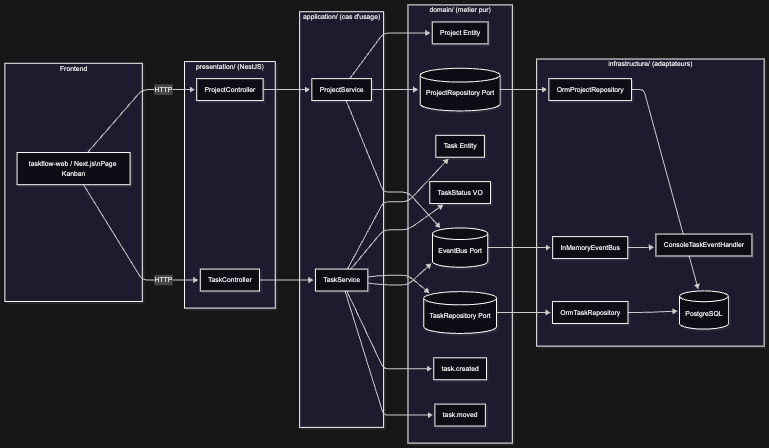

# TaskFlow — Dossier de Projet

## Équipe

| Nom | Prénom | GitHub |
|-----|--------|--------|
| Lahaye | Kilian | KilianLhy |
| Sow | Moustapha | moustaphasow01 |
| Stawiarski | Hugo | hugostarte |

---

## Stack technique

| Couche | Technologie |
|--------|-------------|
| Frontend | Next.js (App Router) + React |
| Backend | NestJS |
| Base de données | PostgreSQL + ORM |
| Tests | Jest + Testing Library |
| CI | GitHub Actions |
| Déploiement | Docker + Docker Compose |

---

## Architecture — Vue d'ensemble

### Proposition d'architecture (alignée avec le projet)




### Regles d'architecture a respecter

- Le domaine ne depend d'aucun framework (`NestJS`, ORM, HTTP, WebSocket).
- Les controllers recoivent les requetes et deleguent; aucune logique metier dans `presentation/`.
- Les services applicatifs orchestrent les cas d'usage et ne parlent qu'aux interfaces (ports).
- Les acces base de donnees passent uniquement par les repositories (ports + adaptateurs).
- Les evenements metier sont publies par le domaine/applicatif sans connaitre les consommateurs.

### Structure cible (backend NestJS)

```text
taskflow-api/src/
	project/
		domain/
			project.entity.ts
			project.repository.ts
			project-created.event.ts
		application/
			project.service.ts
		infrastructure/
			orm-project.repository.ts
		presentation/
			project.controller.ts

	task/
		domain/
			task.entity.ts
			task-status.vo.ts
			task.repository.ts
			task-created.event.ts
			task-moved.event.ts
		application/
			task.service.ts
		infrastructure/
			orm-task.repository.ts
		presentation/
			task.controller.ts

	shared/
		events/
			event-bus.port.ts
			nest-event-bus.adapter.ts
			handlers/
				console.handler.ts
				notification.handler.ts
				websocket.handler.ts
				audit.handler.ts
```

### Projection par rendu (pour absorber les disruptions)

- Rendu 1: `project` + `task`, `TaskStatus`, events `task.created` et `task.moved`, `ConsoleHandler`, tests unitaires metier sans BDD, frontend Kanban minimal.
- Rendu 2: ajout `WebSocketHandler`, notifications multi-canal, `workspaceId` (multi-tenant basique), Docker Compose complet, CI verte, sans reecriture du domaine.
- Rendu 3: ajout resilience (circuit breaker email), coexistence API v1/v2, audit trail automatique, toujours par ajout d'adaptateurs/handlers.

### Frontend minimal attendu (Rendu 1)

- Une page Kanban avec 3 colonnes (`Todo`, `In Progress`, `Done`).
- Appels REST vers l'API NestJS.
- Action de deplacement de tache par bouton (drag-and-drop non obligatoire).

---

## ADR — Architecture Decision Records

> Chaque ADR est un fichier séparé dans `docs/`. Utilisez le template [`docs/ADR-template.md`](docs/ADR-template.md) et l'exemple [`docs/ADR-000.md`](docs/ADR-000.md).
>
> Listez ici vos ADR une fois créés :

| ADR | Titre | Statut |
|-----|-------|--------|
| [ADR-001](docs/ADR-001.md) | Choix de stack NestJS + Next.js | Accepté |
| [ADR-002](docs/ADR-002.md) | | |
| [ADR-003](docs/ADR-003.md) | | |

---

## Tags de rendu

| Phase | Tag attendu | Statut |
|------|-------------|--------|
| Rendu 1 | `rendu-1` | |
| Rendu 2 | `rendu-2` | |
| Rendu 3 | `rendu-3` | |

---

## Rendu 1 — Fondations *(7h30)*

### Checklist

- [ ] Module `project` (controller / service / repository / interface)
- [ ] Module `task` avec Value Object `TaskStatus` (transitions Todo → In Progress → Done)
- [ ] Publication d'au moins deux domain events (`task.created`, `task.moved`)
- [ ] `ConsoleHandler` branché sur ces deux events (affiche event + taskId + horodatage dans la console)
- [ ] Couche repository abstraite (interface + implémentation ORM)
- [ ] Frontend : page unique, colonnes Kanban, déplacement de tâche (bouton suffit)
- [ ] Tests unitaires des services (transitions de statut + publication d'events, sans BDD)
- [ ] Authentification non requise — identifiant utilisateur simulé (`X-User-Id` ou constante)
- [ ] Procédure de démarrage locale simple et documentée
- [ ] 3 ADR minimum
- [ ] Schéma d'architecture
- [ ] Tag `rendu-1` créé et poussé

### Analyse d'impact

> Quels fichiers ont été modifiés ? Lesquels sont restés stables ?

---

## Rendu 2 — Évolution *(13h30)*

### Disruption reçue

> Résumer ici les changements demandés par le "client"

### Checklist

- [ ] Authentification JWT (inscription, connexion, token)
- [ ] Temps réel sur le Kanban (déplacement de tâche visible par tous)
- [ ] Notifications multi-canal extensibles (email + in-app) + préférences par canal
- [ ] Audit trail automatique (qui a fait quoi et quand)
- [ ] CLI d'administration (créer projet, créer tâche, seed de démo) — commande documentée dans le README
- [ ] Docker Compose fonctionnel depuis un clone propre
- [ ] `docker compose up` démarre tout avec un `.env.example` documenté
- [ ] Pipeline CI GitHub Actions au vert
- [ ] 4 nouveaux ADR (auth, temps réel, notifications, audit)
- [ ] Schéma d'architecture mis à jour
- [ ] Analyse d'impact : ce qui a changé vs ce qui n'a PAS changé
- [ ] Tag `rendu-2` créé et poussé

### Analyse d'impact

> Ce qui a changé :
> Ce qui n'a PAS changé :

---

## Rendu 3 — Résilience *(16h30)*

### Disruptions reçues

> Résumer ici les changements demandés par le "client"

### Checklist

- [ ] Résilience des consommateurs d'événements (panne d'un canal sans impact sur les autres)
- [ ] Dead-letter queue pour les messages non traités
- [ ] API v1 + v2 coexistantes et rétrocompatibles
- [ ] Multi-workspace (isolation des données par entreprise)
- [ ] ADR résilience + versioning + multi-workspace
- [ ] Tableau des scénarios de panne
- [ ] Tag `rendu-3` créé et poussé

### Tableau des scénarios de panne

| Scénario | Comportement attendu | Comportement constaté |
|----------|----------------------|-----------------------|
| Canal email indisponible | Le système continue, message mis en file | |
| Mécanisme temps réel coupé | Kanban fonctionnel en mode requête classique | |
| | | |

### Analyse d'impact

> Ce qui a changé :
> Ce qui n'a PAS changé :

---

## Soutenance *(20 min + 10 min de questions)*

### Plan

1. **Démo live** (5 min) — `docker compose up`, Kanban temps réel sur 2 navigateurs
2. **Ce qui n'a pas changé** (5 min) — Fichiers stables entre les phases, stabilité du domain
3. **Ce qu'on a appris** (5 min) — ADR dont on est le plus fier, choix qu'on referait différemment
4. **Métriques** (3 min) — `git diff --stat` entre chaque phase
5. **Questions libres** (2 min avant les questions de l'enseignant)

---

## Note finale

| Livrable | Coefficient | Note |
|----------|-------------|------|
| Rendu 1 (Fondations) | × 0,20 | /20 |
| Rendu 2 (Évolution) | × 0,25 | /20 |
| Rendu 3 (Résilience) | × 0,30 | /20 |
| Soutenance | × 0,25 | /20 |
| **Note finale** | | **/20** |
